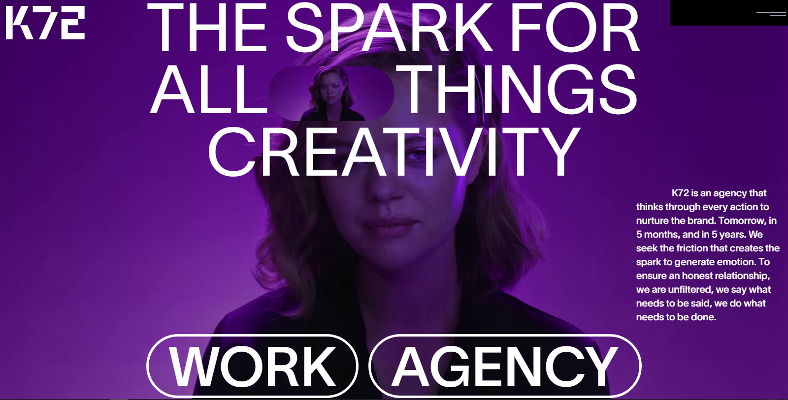

# K72 Website Clone



[](https://k72-theta.vercel.app/)

A modern clone of the [K72 creative agency website](https://k72.ca/en) built with React, TypeScript, and Vite. Features smooth animations, video backgrounds, and responsive design.

> **Disclaimer**: This is a personal learning project and a tribute to the beautiful design of [K72](https://k72.ca/en). If the original website owners have any concerns about this clone, please contact me and I'll be happy to remove it immediately. This project is for educational purposes only.

## 🚀 Live Demo

**[Visit Website](https://k72-theta.vercel.app/)**

## 🛠️ Tech Stack

- **React** 19.1.1 + **TypeScript**
- **Vite** for build tooling
- **Tailwind CSS** for styling
- **GSAP** for animations
- **React Router** for navigation


## 🚀 Quick Start

```bash
# Clone the repository
git clone <https://github.com/kirito666coder/k72.git>
cd k72

# Install dependencies
npm install

# Start development server
npm run dev
```

**K72 Website Clone** - A modern recreation of the [K72 creative agency website](https://k72.ca/en).

**Original Website**: [k72.ca](https://k72.ca/en) - "The spark for all things creative"

*This project is created for educational purposes and as a tribute to the original design. All rights to the original design belong to K72 Creative Agency.*